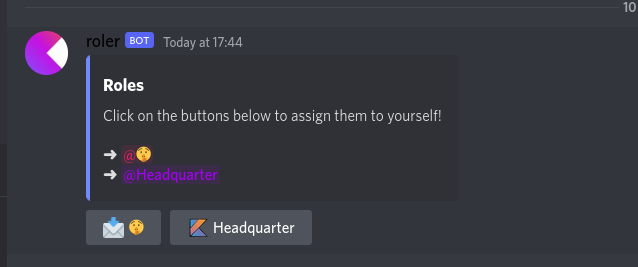

# Roler
A Discord Bot using [Kord](https://github.com/kordlib/kord) and [Kotlin](https://kotlinlang.org) that adds a simple embed where you can pick roles.
To deploy I'm using Docker.
<br>This bot is used on my [Developer Discord](https://discord.gg/z5xBpunxH3).



## Self Hosting
You can use this bot by urself too. Simply pull the [latest docker image](https://github.com/btwonion/Roler/pkgs/container/roler) and create docker-compose.yml.
<br>Additionally you have to create an .env file that works as a config. Below you can see an example file. To create a role you have to add the role_id and role_emoji properties.

<details>
<summary>.env</summary>

```properties
BOT_TOKEN=<YOURBOTTOKEN>
GUILD_ID=<YOURGUILDID>
headquarter_id=1006559216280031372
headquarter_emoji=<:kotlin_art:1006652061334655047>
psst_id=1006951300543545434
psst_emoji=📩
```

</details>

<details>
<summary>docker-compose.yml</summary>

```yaml
version: "3"

services:
  bot:
    image: ghcr.io/btwonion/roler:master
    env_file:
      - /home/onion/storage/roler-config.env
    restart: unless-stopped
    container_name: roler
```

</details>

## 💸 Support

<a href="https://www.buymeacoffee.com/btwonion" target="_blank">

</a>
